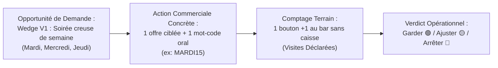
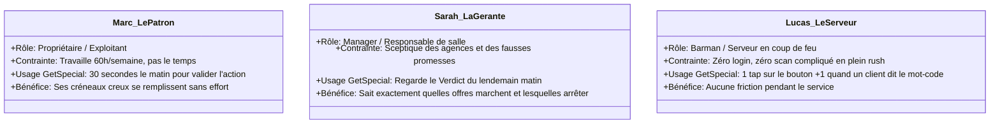
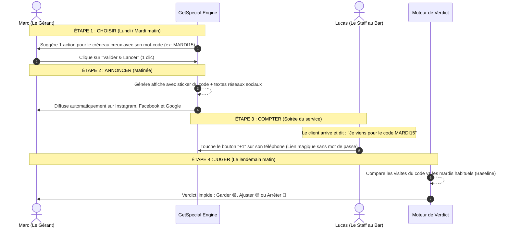
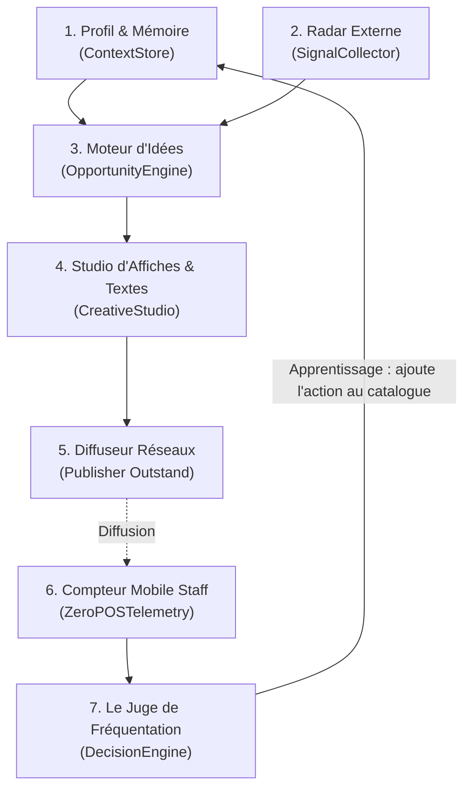
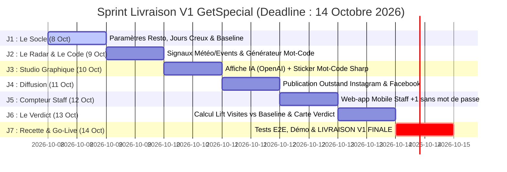

# GetSpecial — La Bible Produit & Guide d'Architecture (De 0 à 1)

> **Guide de référence officiel de l'équipe**  
> **Mission :** Remplir les soirées creuses des bars et restaurants indépendants, et prouver par A+B que ça a fonctionné.  
> **Vision long terme :** Devenir le copilote qui aide les restaurants à piloter et optimiser toute leur demande.

---

## 1. La Vision Produit & Le Manifeste

### 1.1 Pourquoi GetSpecial existe ?
En 2025-2026, plus de 60 % des bars et restaurants indépendants subissent une baisse de fréquentation. Du mardi au jeudi, leurs salles sont à moitié vides, leurs serveurs attendent le client, et leurs charges fixes continuent de tourner. 

Leurs seules options actuelles sont mauvaises :
* **Payer une agence ou un community manager (800 €/mois) :** de jolies photos et des "likes" sur Instagram, mais aucune idée de si cela ramène un seul client en salle.
* **Faire des posts à la va-vite le jour même :** chronophage, mal ciblé, et impossible à mesurer.
* **Installer des logiciels de caisse ultra-complexes :** lourds, chers, intrusifs et réservés aux grandes chaînes.

### 1.2 Notre réponse : La simplicité radicale
GetSpecial n'est **pas un outil de réseaux sociaux pour faire des likes**. C'est un **générateur de demande mesurable**.

### 1.3 Principes Produits Intangibles vs Paramètres Expérimentaux du MVP

Pour éviter de figer des hypothèses de travail comme des dogmes, l'équipe distingue rigoureusement deux niveaux :

| Niveau | Éléments | Statut |
| :--- | :--- | :--- |
| **Principes Produits Intangibles** | • **Mesure honnête :** On mesure des **visites déclarées** (personnes qui mentionnent le mot-code), sans jamais extrapoler une hausse magique de chiffre d'affaires global. • **Zéro intégration caisse :** Aucune dépendance POS, aucun matériel branché. • **Validation humaine obligatoire :** Rien n'est publié sans 1 clic du gérant. • **Sobriété :** Silence total s'il n'y a pas d'opportunité pertinente. | 🔒 **Figés dans le marbre** |
| **Paramètres Opérationnels (Hypothèses MVP)** | • **Rayon des événements (ex: 2 km)** : à ajuster selon qu'on est en hypercentre piéton ou en périphérie. • **Seuils de verdict (ex: +25% / +5%)** : hypothèses de travail à calibrer avec les premiers exploitants réels. • **Créneaux cibles initiaux (Mardi-Jeudi)** : le premier cas d'usage (`EMPTY_SLOT`), mais pas la limite finale du système. • **Horaires de cron (06h00, 07h00)** : configurables par établissement. | 🧪 **Expérimentaux (Ajustables sur le terrain)** |

---

## 2. Les 3 Personas du Quotidien

Pour réussir le produit, chaque fonctionnalité doit servir l'un de ces 3 acteurs :

---

## 3. La Boucle de Valeur en 4 Temps

Chaque cycle GetSpecial suit immuablement ces 4 étapes simples :

---

## 4. La Boîte à Outils Externe (Les 6 Partenaires Clés)

Pour aller vite et rester ultra-fiable, on s'appuie sur les meilleurs services du marché sans réinventer la roue :

| Outil Externe | Rôle simple dans GetSpecial | Pourquoi ce choix ? | En cas de panne (Fallback) |
| :--- | :--- | :--- | :--- |
| **Google Places API** | **Fiche d'identité du restaurant** : adresse, coordonnées GPS, photos officielles, note et horaires d'ouverture réels. | C'est la référence mondiale pour les restos. Tout est configuré en 1 clic dès l'inscription. | Données enregistrées de façon permanente dans notre base. |
| **Open-Meteo API** | **Radar météo** : détecte quand sortir la terrasse (soleil inattendu) ou quand proposer un plat réconfortant (pluie, froid). | Gratuit, mondial, ultra-rapide et sans clé complexe. | OpenWeatherMap en secours. Si panne, on désactive le signal météo temporairement. |
| **Ticketmaster Discovery** | **Radar d'événements** : détecte les concerts, matchs et spectacles à moins de 2 km pour capter le flux avant/après. | Fournit l'heure de début et le public attendu. Permet de faire des offres « Pre-Show ». | On s'appuie sur le calendrier des fêtes et les marronniers habituels. |
| **Claude Sonnet 4.6 (Anthropic)** | **Le Cerveau Rédactionnel** : réfléchit à la meilleure offre à proposer et rédige les légendes adaptées au ton du bar (chaleureux, festif). | Modèle de pointe : très fort en logique de décision et plume naturelle sans clichés robots. | Gabarits de textes pré-rédigés de secours garantis sans bug. |
| **OpenAI Image API** | **Le Photographe Virtuel** : génère des arrière-plans d'assiettes et de verres gourmands et professionnels. | Une API reconnue qui crée des visuels appétissants sur mesure selon la spécialité du restaurant. | Bibliothèque de photos réelles du restaurant enregistrées à l'onboarding. |
| **Outstand API** | **Le Diffuseur Réseaux** : publie l'affiche et les textes sur Instagram et Facebook sans que le patron n'ait à copier-coller. | Déjà connecté au projet, gère l'autorisation des comptes réseaux et planifie la publication. | Bouton de secours pour télécharger l'image et copier le texte en 1 clic. |

---

## 5. Les 6 Modules du Système & Leur Mode de Fonctionnement

Chaque module a une responsabilité unique et limpide :

### Module 1 : La Mémoire du Restaurant (`ContextStore`)
* **Ce qu'il sait :** Les spécialités de la maison (ex: tapas, bières artisanales), les soirs creux ciblés (ex: mardi et mercredi), et la fréquentation moyenne habituelle (ex: 12 personnes un mardi sans action).
* **Comment il fonctionne :** Il garantit l'étanchéité totale : chaque restaurant ne voit que ses propres données. Il retient ce qui a déjà marché dans le passé.

### Module 2 : Le Radar du Quartier (`SignalCollector`)
* **Ce qu'il fait :** Chaque matin à 06h00, il regarde la météo du jour et scanne les événements autour de l'établissement.
* **Sa règle simple :** Il jette tout ce qui est trop loin (> 2 km) ou sans rapport avec l'activité du resto. Il ne garde que les 2 signaux les plus pertinents.

### Module 3 : Le Moteur d'Opportunités de Demande (`DemandOpportunityEngine`)
* **Sa vision architecturale :** Il n'est pas limité aux créneaux vides. C'est un moteur généraliste d'opportunités de demande avec une typologie extensible :
  * `EMPTY_SLOT` : **Le Wedge V1 prioritaire** (soirées creuses récurrentes déclarées, ex: mardi/mercredi).
  * `LOCAL_EVENT` : Opportunité événementielle (concert ou match à proximité immédiate).
  * `WEATHER_OPPORTUNITY` : Opportunité météo (terrasse surprise ou météo propice au réconfort).
  * `SPECIAL_OCCASION` : Marronniers et célébrations locales.
  * `WEAK_PERIOD` : Périodes creuses saisonnières.
* **Sa règle de sobriété :** Si le restaurant est déjà complet ou s'il n'y a rien de pertinent à proposer, **il ne dit rien**. Zéro spam pour le patron.
* **Le générateur de mot-code :** Il invente un code court, facile à retenir et à prononcer au comptoir (ex: `MARDI15`, `SOLEIL25`, `ROCK20`).

### Module 4 : Le Studio d'Affiches & Textes (`CreativeStudio`)
* **Ce qu'il produit en 30 secondes :**
  1. Une image gourmande créée par l'IA.
  2. **Un sticker propre et lisible incrusté par-dessus** avec le mot-code (`Dites MARDI15 au comptoir`), les horaires et le logo du bar. *(Fait avec un moteur graphique interne : impossible d'avoir du texte déformé ou illisible).*
  3. Des textes courts prêts pour Instagram, Facebook et Google.

### Module 5 : Le Diffuseur Sécurisé (`PublishingPipeline`)
* **Ce qu'il fait :** Dès que le patron a cliqué sur "Valider", il envoie le post à Outstand qui le publie à l'heure idéale.
* **Sécurité totale :** Rien ne part automatiquement sans validation humaine, et un système anti-doublon empêche toute publication accidentelle en double.

### Module 6 : Le Compteur Staff Mobile (« Le Tapodrome »)
* **Pour qui :** Le serveur ou le barman pendant le rush du soir.
* **Comment ça marche :** 
  - Le gérant envoie un lien WhatsApp à son équipe ou pose un QR code au bar (`/counter/[jeton]`).
  - **Zéro mot de passe à saisir.** 
  - La page affiche le code du soir et un grand bouton tactile **`+1 Visite Déclarée`**.
  - À chaque fois qu'un client dit *"Je viens pour le code MARDI15"*, le barman tape sur l'écran (le téléphone vibre pour confirmer).
  - **Fonctionne même sans connexion :** si le réseau saute en cave ou au bar, les clics sont gardés en mémoire et envoyés dès que la connexion revient.

### Module 7 : Le Juge du Lendemain (`DecisionEngine`)
* **Quand :** Le lendemain matin à 07h00 sur le téléphone du gérant.
* **Ce qu'il mesure avec rigueur :** Il ne prétend pas mesurer l'ensemble du chiffre d'affaires du restaurant. Il compte le **volume direct de visites déclarées** attribuables à l'action et le compare aux performances témoins ou historiques de ce type d'action.
* **Les 3 Orientations d'action (Hypothèses calibrables) :**
  * 🟢 **GARDER :** Forte dynamique de visites déclarées par rapport au volume témoin. *« 21 visites déclarées grâce au code. L'offre résonne fortement auprès de votre public, à reconduire sur ce créneau ! »*
  * 🟡 **AJUSTER :** Dynamique modeste. *« 11 visites déclarées. L'offre intéresse mais l'horaire ou le positionnement peut être affiné. »*
  * 🔴 **ARRÊTER :** Faible traction. *« Seulement 2 mentions du code. Cette promotion n'a pas déclenché de mouvement significatif. Mieux vaut tester une autre formule ou préserver sa marge. »*

---

## 6. La Roadmap Commando de 0 à 1 (Objectif V1 au 14 Octobre 2026)

Le développement est organisé en un **Sprint de 7 jours** (du 8 au 14 octobre 2026) pour livrer la boucle complète prête à être vendue et testée sur le terrain le **14 octobre au soir** :

### J1 (Jeudi 8 Octobre) — Le Socle & Données Fondamentales
* Intégration de l'onboarding rapide avec **Google Places API** (nom, adresse, photos, horaires).
* Enregistrement obligatoire des 2 variables clés de chaque établissement :
  1. **Ses créneaux creux ciblés** (`offPeakDays` : ex. *mardi et mercredi soir*).
  2. **Sa fréquentation moyenne témoin** (`baselineCovers` : ex. *12 personnes sans action*).
* *Livrable J1 :* Le système sait exactement quand le restaurant a besoin de clients et quel est son volume de référence.

### J2 (Vendredi 9 Octobre) — Le Radar de Quartier & Le Mot-Code
* Branchement du radar météo (Open-Meteo) et des événements locaux (Ticketmaster).
* Règle de déclenchement : proposition d'action uniquement avant un jour creux ciblé.
* Moteur de mot-code : génération automatique du code court et oral (`MARDI15`, `SOLEIL25`, `ROCK20`).
* *Livrable J2 :* L'application propose 1 action concrète et son mot-code dès qu'un créneau vide approche.

### J3 (Samedi 10 Octobre) — Le Studio Créatif & L'Affiche Hybride
* Génération de fond gourmand par l'API OpenAI Image.
* Incrustation locale vectorielle nette via `Sharp` du sticker officiel (`Dites MARDI15 au comptoir`), des horaires et du logo.
* Rédaction des 3 variantes de texte pour les réseaux via Claude Sonnet 4.6.
* *Livrable J3 :* Le kit de communication complet est prêt en 30 secondes, sans texte déformé.

### J4 (Dimanche 11 Octobre) — La Diffusion Réseaux Sociaux (Outstand)
* Branchement du bouton *"Valider & Diffuser"* à l'API Outstand pour Instagram et Facebook.
* Sécurisation par clé d'idempotence (aucun risque de double post accidentel).
* *Livrable J4 :* En 1 clic le matin, l'affiche officielle est publiée sur les pages sociales de l'établissement.

### J5 (Lundi 12 Octobre) — Le Compteur Staff Mobile (Le Cœur de la Preuve)
* Création de la page web mobile `/counter/[jeton]` accessible sans identifiant ni mot de passe.
* Grand bouton tactile **`+1 Visite Déclarée`** avec vibration haptique au toucher.
* Mode hors-ligne complet (sauvegarde des clics même en cas de coupure réseau en cave).
* Bouton d'envoi rapide du lien à l'équipe par WhatsApp.
* *Livrable J5 :* Le serveur au bar enregistre chaque mention du code en 1 seconde sur son téléphone.

### J6 (Mardi 13 Octobre) — Le Moteur de Verdict du Lendemain
* Clôture automatique du service à 02h00 du matin et sommation des visites déclarées.
* Calcul mathématique du Lift : $Visites - Baseline$.
* Affichage de la carte de Verdict au réveil du patron : 🟢 **Garder**, 🟡 **Ajuster**, ou 🔴 **Arrêter**.
* Ajout automatique de l'action gagnante dans la bibliothèque du restaurant.
* *Livrable J6 :* Le gérant reçoit la preuve claire de l'impact financier de son action.

### J7 (Mercredi 14 Octobre) — Recette Finale, Démo & Livraison V1 (DEADLINE)
* Test de bout en bout du cycle complet (*Choisir $\rightarrow$ Annoncer $\rightarrow$ Compter $\rightarrow$ Juger*).
* Intégration du bouton d'urgence *"Pause Service"* (gel immédiat des publications et du compteur).
* **LIVRAISON V1 OFFICIELLE VALIDÉE & PRÊTE POUR LES CLIENTS.**

---

## 7. Tableau Récapitulatif d'Alignement Équipe

Ce tableau sert d'aide-mémoire pour chaque membre de l'équipe au quotidien :

| Question clé | Réponse de référence pour l'équipe |
| :--- | :--- |
| **Quel est le but du produit ?** | Remplir les soirées calmes et prouver au restaurateur que ça a marché grâce à un mot-code oral compté au bar. |
| **Quelle est notre unité de mesure ?** | Les **visites déclarées** (le nombre de personnes ayant prononcé le mot-code au comptoir). Pas les likes, pas le chiffre d'affaires virtuel. |
| **Comment le staff compte-t-il ?** | Sur une page web mobile ultra-légère sans mot de passe avec un gros bouton `+1`. |
| **Comment sait-on si c'est un succès ?** | Si l'action génère $+25\%$ de visites par rapport à la moyenne habituelle du jour, elle est étiquetée **GARDER 🟢**. |
| **Quels sont nos outils externes ?** | Google Places (resto), Open-Meteo (météo), Ticketmaster (événements), Claude Sonnet 4.6 (textes), OpenAI Image (visuels), Outstand (diffusion). |
| **Combien de temps le patron y passe-t-il ?** | Moins de 60 secondes pour valider le matin, et 10 secondes pour lire le verdict le lendemain. |
